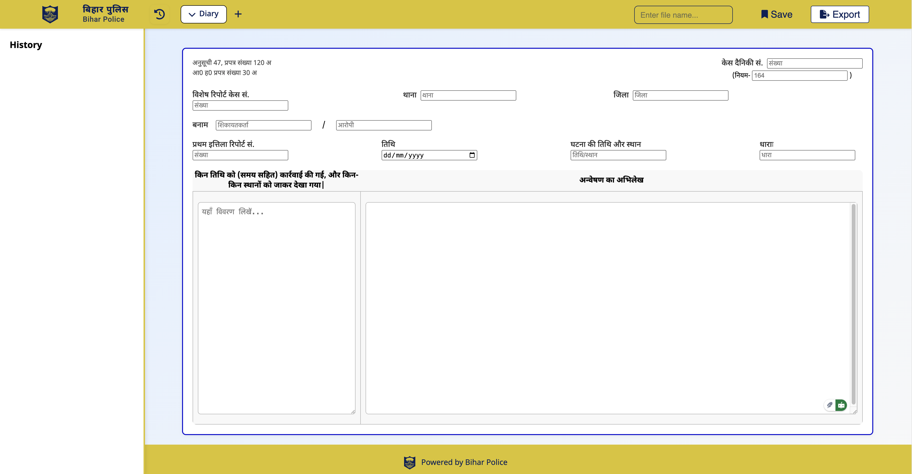

# 📝 BP Writing Tool
**BP Writing Tool** is a modern, cross-platform desktop application that makes writing in Hindi (Devanagari script) fast, accurate, and accessible. Simply type in Hinglish (Romanized Hindi), and the tool instantly transliterates your text into Hindi script using advanced language models. Whether you're a student, teacher, professional, or content creator, BP Writing Tool helps you write, organize, and export Hindi documents with ease—all while keeping your data private and offline.

---


## ℹ️ What is Bihar Police Writing Tool?

BP Writing Tool is designed for anyone who wants to write in Hindi without needing to know the Devanagari keyboard layout. By leveraging transliteration, you can type phonetically in English letters and see your words appear in Hindi. The application provides a clean interface for creating, editing, saving, and exporting documents, and it works seamlessly on both Windows and macOS.

---
## 🛡️ Purpose and Audience

This project is specially developed for the **Bihar Police** to make writing in Hindi easier, faster, and more accessible in a fully digitalized format. It is designed to streamline the process of creating official documents, reports, and communications in Hindi without the need for a Devanagari keyboard or specialized training.

**Key benefits for Bihar Police:**
- **No Internet Required:** The application works entirely offline, ensuring data privacy and security. There is no dependency on the internet or any third-party service.
- **Digital Transformation:** Enables officers and staff to create, manage, and export Hindi documents digitally, reducing paperwork and manual errors.
- **User-Friendly:** Anyone can type in Hinglish (Romanized Hindi), and the tool will instantly convert it to accurate Hindi script.
- **Data Privacy:** All documents are stored locally on the user's machine, eliminating risks associated with cloud storage or external applications.

By adopting BP Writing Tool, the Bihar Police can modernize their documentation workflow, improve efficiency, and ensure that sensitive information remains secure and offline.

---
## ✨ Key Features

- **Instant Transliteration:** Type in Hinglish, see Hindi output in real time.
- **Document Management:** Create, edit, save, and delete multiple documents.
- **History Sidebar:** Browse and manage your document history, grouped by date.
- **Export & Print:** Download or print your Hindi documents in a styled format.
- **Cross-Platform:** Available for Windows and macOS as a standalone app.
- **Offline & Private:** All data is stored locally in a lightweight database (`db.json`).
- **No Python Needed:** End users don’t need Python installed—just run the packaged app.
- **GUI Controller:** A Tkinter-based GUI lets you start and stop the server easily (when packaged).

---

## 🚀 Typical Use Cases

- **Academic Writing:** Essays, assignments, and study notes in Hindi.
- **Professional Documents:** Letters, reports, and business proposals.
- **Creative Writing:** Stories, poems, and articles in your native language.
- **Content Creation:** Social media posts, blogs, and more.

---

## 🏗️ Technology Stack

- **Frontend:** HTML, CSS, JavaScript (served via Flask)
- **Backend:** Python (Flask)
- **Transliteration:** [hindi-xlit](https://pypi.org/project/hindi-xlit/)
- **Database:** TinyDB (local JSON storage)
- **Packaging:** PyInstaller for standalone executables

---

## 📦 Project Structure

```
BP-writingTool/
├── app.py                  # Main Flask application
├── db.json                 # TinyDB database (auto-created)
├── requirements.txt        # Python dependencies
├── Makefile                # Build and management commands
├── MyApp.spec              # PyInstaller spec for packaging
├── app.spec                # Alternate PyInstaller spec
├── hook-hindi_xlit.py      # PyInstaller hook for hindi-xlit
├── static/
│   ├── app.js
│   ├── style.css
│   ├── css/
│   ├── images/
│   └── js/
├── templates/
│   └── index.html
└── README.md
```

---

## 🛠️ Getting Started (For Developers)

### 1. Clone the Repository

```bash
git clone <your-repository-url>
cd BP-writingTool/BP-writingTool
```

### 2. Create and Activate a Virtual Environment

**On Windows:**
```bash
python -m venv venv
.\venv\Scripts\activate
```

**On macOS/Linux:**
```bash
python3 -m venv venv
source venv/bin/activate
```

### 3. Install Dependencies

**Using pip:**
```bash
pip install -r requirements.txt
```

**Or using the Makefile (macOS/Linux):**
```bash
make install
```

---

## 🚀 Running the Application

**From Source:**
```bash
python app.py
```
or
```bash
make run
```

- The app will be available at [http://127.0.0.1:5000](http://127.0.0.1:5000).

---

## 📦 Building the Standalone Application

The app is bundled using **PyInstaller**. Use the provided spec file and Makefile.

### On Windows

```bash
pyinstaller MyApp.spec
```
- The executable will be in the `dist/` folder as `MyApp.exe`.

### On macOS

```bash
make build
```
- The app bundle will be in `dist/MyApp.app`.

---

## 🧹 Cleaning Build Artifacts

To remove build folders and caches:

```bash
make clean
```

---

## 🧩 Python Packages Used

- **flask**: Web framework for the backend server.
- **hindi-xlit**: Transliteration engine (Hinglish → Devanagari).
- **tinydb**: Lightweight, document-oriented database for storing documents.

Install all with:
```bash
pip install -r requirements.txt
```

---


## 📄 License

MIT License (or specify your license here).

---

## 🙏 Acknowledgements

- [Flask](https://flask.palletsprojects.com/)
- [hindi-xlit](https://pypi.org/project/hindi-xlit/)
- [TinyDB](https://tinydb.readthedocs.io/)