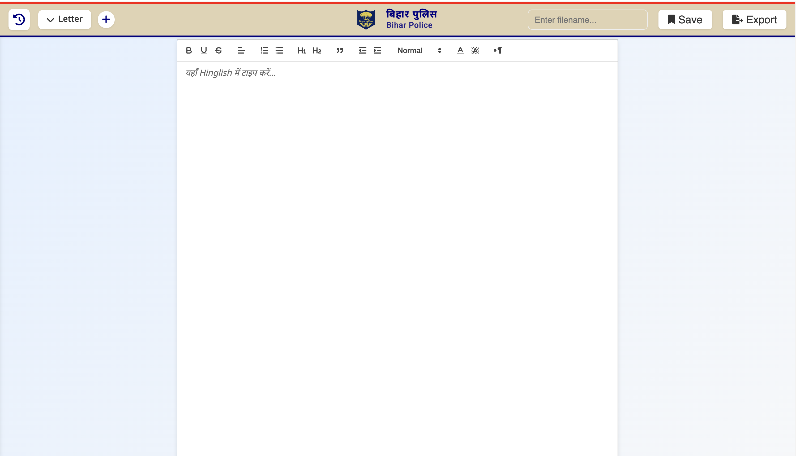
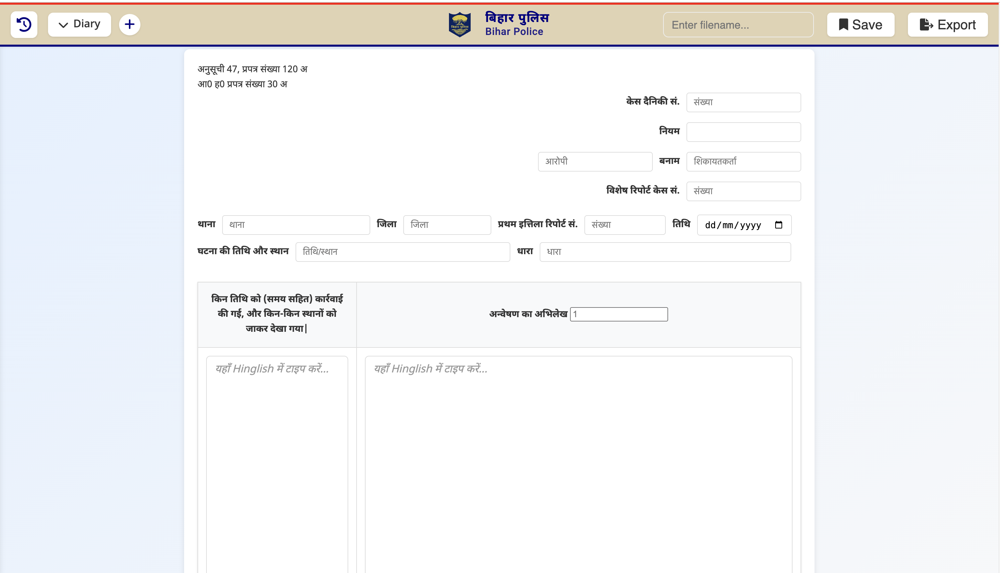
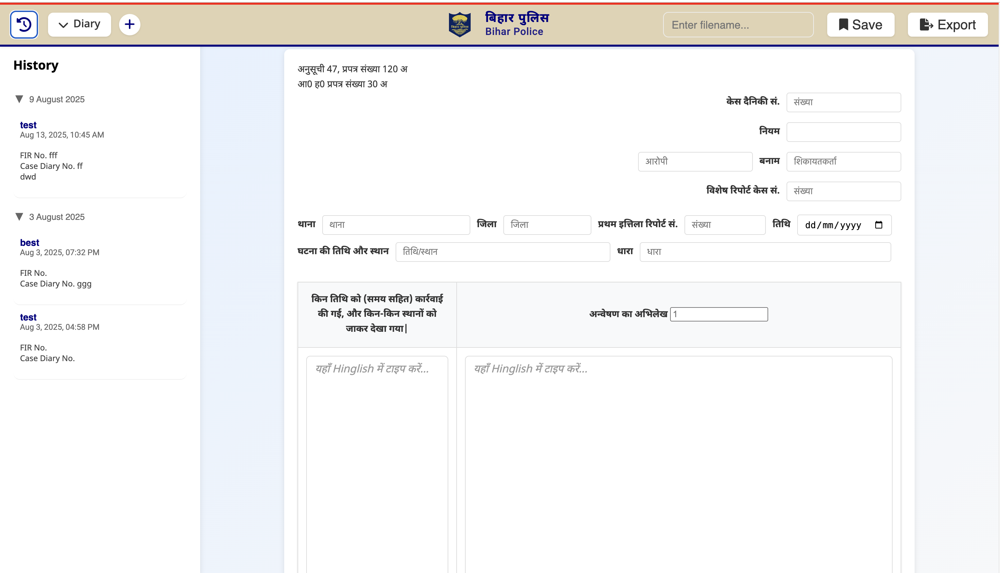
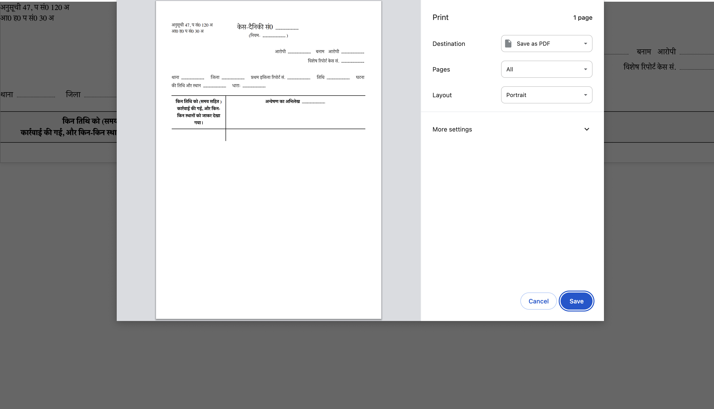

# 📝 BP Writing Tool

[](https://github.com/ayushrskiaa/BP-writingTool/actions)
[](https://opensource.org/licenses/MIT)
[](https://www.python.org/downloads/)
[](https://github.com/ayushrskiaa/BP-writingTool/releases)
[](https://github.com/ayushrskiaa/BP-writingTool/security/code-scanning)

**BP Writing Tool** is a specialized desktop application developed specifically for the **Bihar Police** to facilitate Hindi document creation and management. This tool enables officers and staff to write in Hindi (Devanagari script) efficiently by typing in Hinglish (Romanized Hindi), with instant transliteration to Hindi script using advanced language models.

<table>
  <tr>
    <td></td>
    <td></td>
  </tr>
  <tr>
    <td></td>
    <td></td>
  </tr>
</table>

## ✨ Features

- 🚀 **Instant Transliteration** - Type in Hinglish, see Hindi output in real-time
- 📄 **Document Management** - Create, edit, save, and delete multiple documents
- 📚 **History Sidebar** - Browse and manage your document history, grouped by date
- 📤 **Export & Print** - Download or print your Hindi documents in styled format
- 💻 **Cross-Platform** - Available for Windows and macOS as standalone apps
- 🔒 **Local Data Storage** - All documents stored locally on device
- 🌐 **Extension Integration** - Enhanced input via Chrome extensions (requires internet)
- 🎯 **User-Friendly** - Clean interface with Tkinter-based GUI controller

## 🚀 Quick Start

### Download Latest Release

Visit our [Releases page](https://github.com/ayushrskiaa/BP-writingTool/releases) to download the latest version for your platform:
- **Windows**: Download `BP-writing tool.exe`
- **macOS**: Download `BP-writing-tool-macos.zip`, extract, and drag `MyApp.app` to Applications

### Prerequisites for Full Functionality

**Browser Requirement:** Use Google Chrome browser to access the required extensions.

To use the application at its full potential, install these Chrome browser extensions:

1. **[Google Input Tools](https://chromewebstore.google.com/detail/google-input-tools/mclkkofklkfljcocdinagocijmpgbhab?hl=en-US&utm_source=ext_sidebar)** - Provides virtual keyboards for over 90 languages, full IMEs for over 30 scripts, and handwriting input for over 40 languages. Enables enhanced Hindi input and transliteration.

2. **[Voice In - Speech-To-Text Dictation](https://chromewebstore.google.com/detail/voice-in-speech-to-text-d/pjnefijmagpdjfhhkpljicbbpicelgko?hl=en-US&utm_source=ext_sidebar)** - Enables voice typing in 50+ languages with real-time speech-to-text transcription. Works on 10k+ websites and supports 40+ languages.

**Note:** These extensions require internet connectivity to function, while your document data remains stored locally on your device for privacy and security.

## 🔧 Configuration

The application uses a local TinyDB database (`db.json`) that is automatically created on first run. All documents and settings are stored locally on your device, ensuring complete privacy and data security.

**Data Privacy:** Your documents are never transmitted over the internet and remain stored locally on your device. The Chrome extensions mentioned above require internet connectivity for their functionality, but they do not access your document data.

## 📖 API Documentation

See [doc/api_contracts.md](doc/api_contracts.md) for the full API contract and usage examples.

## 🐛 Issues and Support

If you encounter any issues or have questions:

1. Check the [Issues](https://github.com/ayushrskiaa/BP-writingTool/issues) page for existing solutions
2. Create a new issue with detailed information about your problem
3. Include your operating system, Python version, and any error messages

## 📄 License

This project is licensed under the MIT License - see the [LICENSE](LICENSE) file for details.

---

## 👨‍💻 For Developers

### Prerequisites

- Python 3.11 or higher
- pip (Python package installer)

### Installation from Source

```bash
# Clone the repository
git clone https://github.com/ayushrskiaa/BP-writingTool.git
cd BP-writingTool

# Create virtual environment
python -m venv venv
source venv/bin/activate  # On Windows: venv\Scripts\activate

# Install dependencies
pip install -r requirements.txt

# Run the application
python app.py
```
